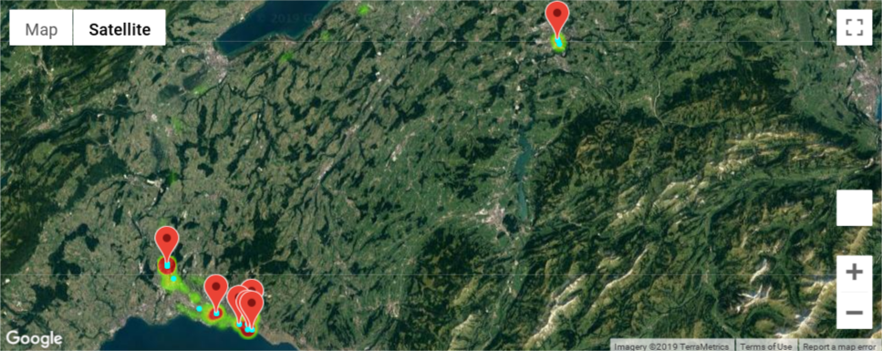
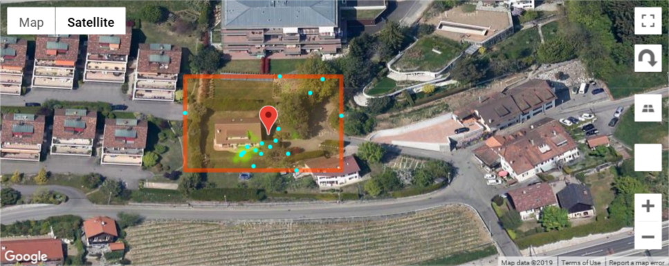

# Wenet project

The WeNet project: diversity-aware, machine-mediated paradigm of social relations.





# API Usage

Full openapi documentation available [here](http://swagger.u-hopper.com/?url=https://bitbucket.org/wenet/wenet-components-documentation/raw/master/sources/wenet-personal_context_builder.json#/)

**Embedded routines**

*  `/routines/` for all routines for all users
*  `/routines/<user_id>/` routine for specific user

**Semantic routines**

*  `/semantic_routines/<user_id>/<weekday:number>/<time>/` routine for a given user, weekday and time period
*  `/semantic_routines_transition/entering/<user_id>/<weekday:number>/<label>/` at what time of the weekday the user is entering the label
*  `/semantic_routines_transition/leaving/<user_id>/<weekday:number>/<label>/` at what time of the weekday the user is leaving the label

**Misc**

*  `/closest/<lat:number>/<lng:number>/<N:number>/` get the closest users

Routines are a dict with model as key, values are dict with user_id as key and list of float as routine of the user.

It's possible to filter models base on name with the parameters `models`. Example to get only `SimpleBOW:PipelineBOW` : `/routines/?models=SimpleBOW:PipelineBOW`. It's possible to add several time `models` parameter to get multiple models.

List of available models can be retrieved with the route `/models/`

You can get the N closest users from a location with the route `/closest/<lat:number>/<lng:number>/<N:number>/`

You can compare the routines of users by using `/compare_routines/` (e.g `/compare_routines/mock_user_1/SimpleLDA:PipelineBOW/?users=mock_user_2&users=mock_user_3`)

# Wenet entry points

Wenet have a single entrypoint for all functionality. By typing `python3 -m wenet_cli_entrypoint --help`, you can have the help

<pre>
usage: wenet_cli_entrypoint.py [-h] [--train] [--update] [--clean_db]
                               [--show SHOW] [--show_all] [--app_run]
                               [--show_models] [--mock] [--closest lat lng N]
                               [--force_update_locations]
                               [--compare_routines COMPARE_ROUTINES]

Wenet Command line interface

optional arguments:
  -h, --help            show this help message and exit
  --train               train the model from the latest data
  --update              update the profiles in the db
  --clean_db            clean the db
  --show SHOW           show a specific profile from the db
  --show_all            show all profiles from the db
  --app_run             run the application
  --show_models         show the list of models
  --mock                use mock data/db instead of real wenet data
  --closest lat lng N   get N closest users from lat, lng
  --force_update_locations
                        update the locations of the users
  --compare_routines COMPARE_ROUTINES
                        compare users (should be separated by ':')
</pre>

## Run the app

You can run the app with `python3 -m wenet_cli_entrypoint --app_run`

# Dev section

## Dev setup

In addition to *requirements.txt*, we recommend the installation of *black==18.9b0* to keep the formating of the code consistent.


### Setup hook

Just create a symlink with `ln -s ../../pre-commit.bash .git/hooks/pre-commit`

### Database

This project uses a Redis database. The database can be changed by editing `config.py` and modifying the line `DEFAULT_REDIS_HOST = "localhost"`. Be aware that this value is overridden in the `Dockerfile`

If you don't modify `config.py` the project expect a Redis database on localhost.

### Install the dependencies

In your virtualenv

```bash
pip install -r requirements.txt
```

## Add new models

To add a new model, you have to create a class that inherit from BaseModelWrapper in the file **wenet_analysis_models.py**.

Example with **SimpleLDA** model

```python
class SimpleLDA(BaseModelWrapper):
    """ Simple LDA over all the users, with 15 topics
    """

    def __init__(
        self, name="simple_lda", n_components=15, random_state=0, n_jobs=-1, **kwargs
    ):
        my_lda = partial(
            LatentDirichletAllocation,
            n_components=15,
            random_state=0,
            n_jobs=-1,
            **kwargs
        )
        super().__init__(my_lda, name)

    def predict(self, *args, **kwargs):
        return super().transform(*args, **kwargs)
```

The wrapper already provides the predict and fit methods for the scikit-like inner model.

If you don't want to use the inner model or you want to customize more your model, you can do like with **SimpleBOW**.

```python
class SimpleBOW(BaseModelWrapper):
    """ Bag-of-words approach, compute the mean of all days
    """

    def __init__(self, name="simple_bow"):
        super().__init__(None, name)

    def transform(self, *args, **kwargs):
        return self.predict(*args, **kwargs)

    def predict(self, *args, **kwargs):
        X = args[0]
        return np.mean(X, axis=0)

    def fit(self, *args, **kwargs):
        pass
```

Then you must register the class to a db index in **config.py**.

`DEFAULT_REDIS_DATABASE_MODEL_0 = "SimpleLDA:PipelineBOW"` you can replace 0 by another number, up to 15.

If you want to use a different pipleline (other data sources or/and other features), you can create them in `wenet_pipelines.py`

## Architecture


### Idiap part in WeNet

We provide the "Personal Context Builder".