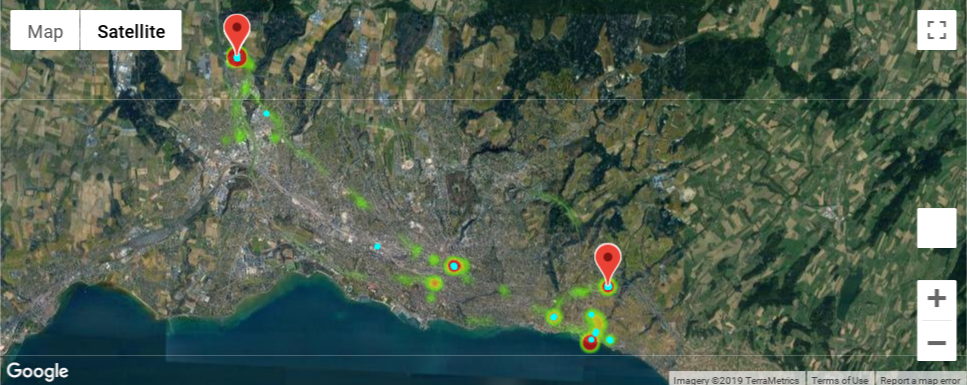
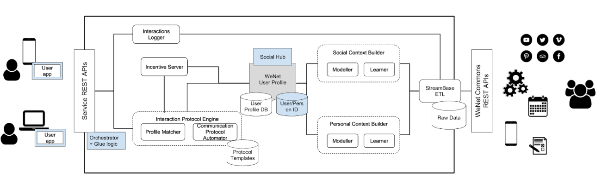

 

# Wenet project

The WeNet project: diversity-aware, machine-mediated paradigm of social relations.

# Dev setup

## Setup hook

Just create a symlink with `ln -s ../../pre-commit.bash .git/hooks/pre-commit`

# API Usage

## Retreive Stay points

### Parameters

* time_min_ms (can be null)
   * minimum time interval allowed to make staypoints
* time_max_ms (can be null)
   * maximum time interval allowed to make staypoints
* distance_max_m (can be null)
   * maximum allowed distance to make staypoints
* datetime_format (can be null)
   * format of the datetimes
* locations 
   * list of locations

Location:

* lat : latitude as float
* lng : longitude as float
* pts_t : datatime as string

Staypoint:

* _lat : latitude as float
* _lng : longitude as float
* _t_start : time at the beginin of the staypoint
* _t_stop : time at the end of the staypoint

## Retreive staypoints example

with httpie, here a example that give 2 locations points and ask for staypoints

`http POST http://localhost:8000/staypoints/ locations:='[{"lat": 1, "lng": 1, "pts_t": "2019-02-01 15:15:57.334131"}, {"lat": 1, "lng": 1, "pts_t": "2019-02-01 15:15:59.334131"}]' time_min_ms:=1000`

<pre>
HTTP/1.1 200 OK
Connection: keep-alive
Content-Length: 119
Content-Type: application/json
Keep-Alive: 5

{
    "staypoints": [
        {
            "_lat": 1.0,
            "_lng": 1.0,
            "_t_start": "2019-02-01 15:15:57.334131",
            "_t_stop": "2019-02-01 15:15:59.334131"
        }
    ]
}
</pre>

The algorithm has found one point.

If we increase the required minimum time by 3 seconds, then the algorithm no longer find any staypoints

`http POST http://localhost:8000/staypoints/ locations:='[{"lat": 1, "lng": 1, "pts_t": "2019-02-01 15:15:57.334131"}, {"lat": 1, "lng": 1, "pts_t": "2019-02-01 15:15:59.334131"}]' time_min_ms:=3000`

<pre>
HTTP/1.1 200 OK
Connection: keep-alive
Content-Length: 17
Content-Type: application/json
Keep-Alive: 5

{
    "staypoints": []
}
</pre>

## Architecture

### Idiap part in WeNet

We provide the "Personal Context Builder".