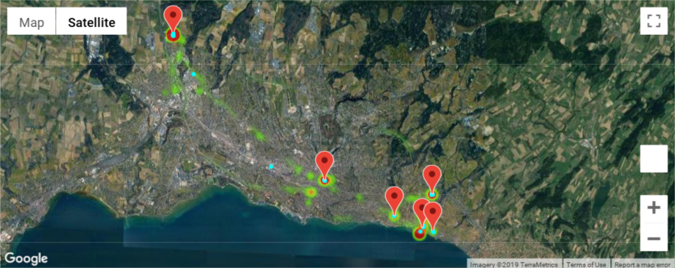

[](https://gitlab.idiap.ch/wenet/personal_context_builder/commits/master) [](https://gitlab.idiap.ch/wenet/personal_context_builder/commits/master)

# Wenet project

The WeNet project: diversity-aware, machine-mediated paradigm of social relations.





# Wenet entry points

Wenet have a single entrypoint for all functionality. By typing `python3 -m wenet_cli_entrypoint --help`, you can have the help

<pre>
usage: wenet_cli_entrypoint.py [-h] [--train] [--update] [--db_clean]
                               [--show SHOW] [--show_all] [--app_run] [--mock]

Wenet Command line interface

optional arguments:
  -h, --help   show this help message and exit
  --train      train the model from the latest data
  --update     update the profiles in the db
  --db_clean   clean the db
  --show SHOW  show a specific profile from the db
  --show_all   show all profiles from the db
  --app_run    run the application
  --mock       use mock data/db instead of real wenet data
</pre>

## Run the app

You can run the app with `python3 -m wenet_cli_entrypoint --app_run`

# Dev setup

## Setup hook

Just create a symlink with `ln -s ../../pre-commit.bash .git/hooks/pre-commit`

## Database

This project uses a Redis database. The database can be changed by editing `config.py` and modifing the line `DEFAULT_REDIS_HOST = "localhost"`. Be aware that this value is overrided in the `Dockerfile`

If you don't modify `config.py` the project expect a Redis database on localhost.

## Install the dependencies

In your virtualenv

```bash
pip install -r requirements.txt
```

# API Usage

The API provides user's routine with two routes:

*  `/routines/` for all routines for all users
*  `/routines/<user_id>/` routine for specific user

Routines are a dict with model as key, values are dict with user_id as key and list of float as routine of the user.

List of available models can be retreive with the route `/models/`

## Architecture


### Idiap part in WeNet

We provide the "Personal Context Builder".